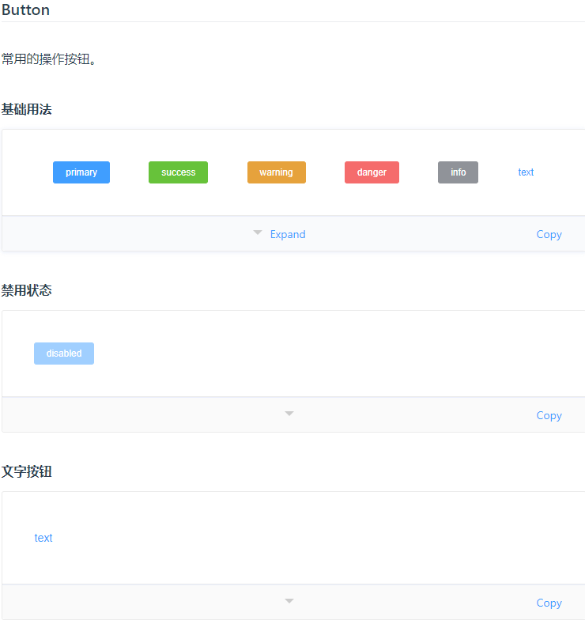
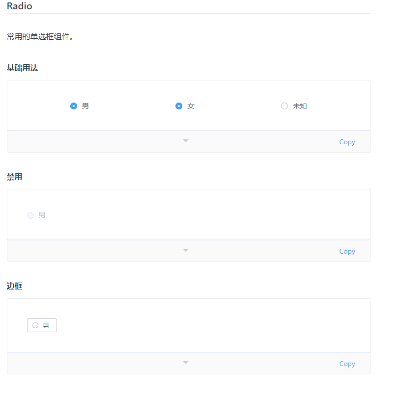
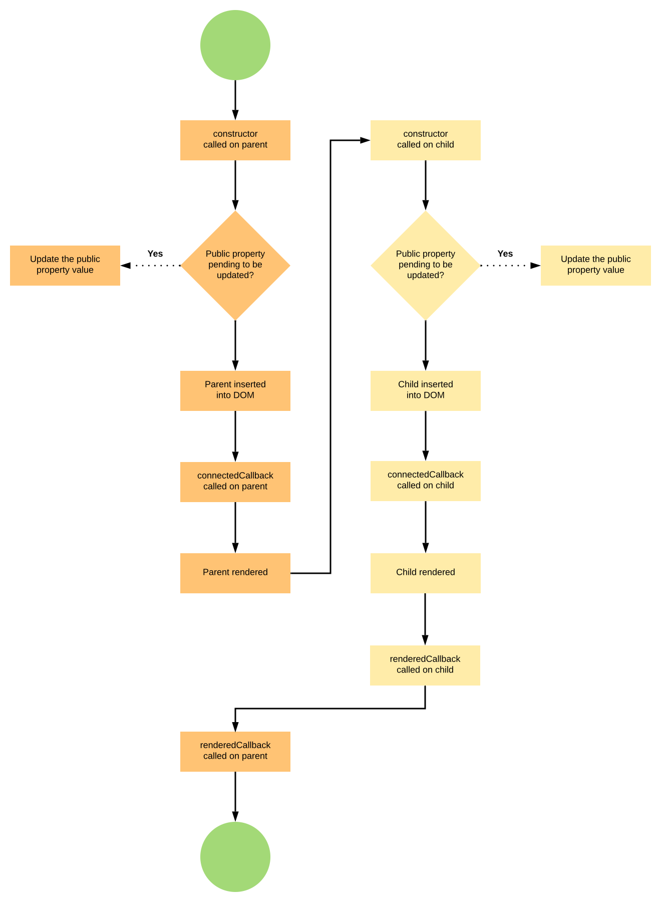
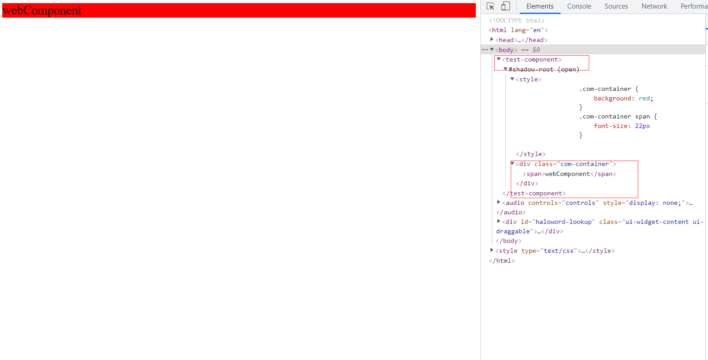

## 前言

### 注意

该仓库已经停止维护，功能已经全部迁移到 [web-component-plus](https://github.com/canyuegongzi/web-component-plus)

该仓库已经停止维护，功能已经全部迁移到 [web-component-plus](https://github.com/canyuegongzi/web-component-plus)

该仓库已经停止维护，功能已经全部迁移到 [web-component-plus](https://github.com/canyuegongzi/web-component-plus)

该仓库已经停止维护，功能已经全部迁移到 [web-component-plus](https://github.com/canyuegongzi/web-component-plus)

该仓库已经停止维护，功能已经全部迁移到 [web-component-plus](https://github.com/canyuegongzi/web-component-plus)

WebComponent 方式是实现组件化的一种解决方案，目前社区内也有很多成熟对方案，如 [Omi](https://github.com/Tencent/omi) 、[stencil](https://github.com/ionic-team/stencil) ， 其中腾讯前端团队的 [Omi](https://github.com/Tencent/omi) 方案还是相当完善的，这篇文章博主打算在 [Omi](https://github.com/Tencent/omi) 方案的基础上进行二次开发并将 elementUI 框架 WebComponent 化。

应用场景案例：

某大型 Web 项目（jquery 技术栈），需要 UI 升级保持和其他项目（技术栈众多，react ，angular ）保持一致，普通场景下可能得根据不同的技术栈造出多套 UI，而根据 WebComponent 方案即可一劳永逸，兼容多套技术栈。

通过这篇文章，能够有这些收获：

- WebComponent 中的高频 Api；
- 如何定义一个简单的 WebComponent 组件；
- 编写 Web-core 包；
- 结合 ElementUI + Web-core 编写第一个 WebComponent 版的 Button 组件。

文章中相关代码均已提交到 github，欢迎 star。

[代码地址](https://github.com/canyuegongzi/web-component-uib)


## 效果预览

基本按钮样式展示如下：



基本单选样式展示如下：



## WebComponent

### 概念

Web Component 是 W3C 专门为组件化提供的一种方案，其中主要指标如下：

1. Shadow DOM
2. Custom Elements
3. HTML Imports
4. HTML Templates

#### Shadow DOM

Shadow DOM 是一个 HTML 的新规范，其允许开发者封装自己的 HTML 标签、CSS 样式和 JavaScript代码，最主要的是可以做到天然的作用域、样式的隔离。

#### Custom Elements

可以允许开发者在 document 中定义并使用的新的dom元素类型，即自定义元素，如 ```window.customElements.define('test-element', TestElement);``` 即可自定义一个可以直接使用的 HTML 标签（test-element）。

#### HTML Imports

HTML imports提供了一种在一个HTML文档中包含和重用另一个HTML文档的方法，使用HTML imports，我们可以很容易的在一个html引入其他html，实现复用，但笔者尚未尝试，感兴趣的可以测试一下。

#### HTML Templates

HTML Templates 字面意思，开发者可以直接自定义组件的内容。

### 生命周期

webComponent 自定义元素如 vue、react 中的组件生命周期一般，状态在运行时会有几个阶段；

1. connectedCallback：当 custom elemen t首次被插入 DOM 时，被调用；
2. disconnectedCallback：当 custom element 从 DOM 中删除时，被调用；
3. adoptedCallback：当 custom element 被移动到新的文档时，被调用；
4. attributeChangedCallback： 当 custom element 增加、删除、修改自身属性时，被调用；但 attributeChangedCallback 需要搭配 observedAttributes 使用。

从网上找了个图，可以作为参考：



### 如何定义一个Component

```ts
class TestComponent extends HTMLElement {
  constructor() {
    super()
    // 使用 attachShadow 与外面样式进行隔离
    const sd = this.attachShadow({ mode: 'open' })
    sd.appendChild(this.initTemplate().content)
  }

  /**
   * 自定义组件内容
   */
  public initTemplate() {
     const template = document.createElement('template')
     template.innerHTML = `
     <style>
       .com-container {
           background: red;
       }
       .com-container span {
           font-size: 22px
       }
     </style>
     <div class="com-container">
       <span>webComponent</span>
     </div>
     `
     return template; 
  }
}
// 定义 test-component 标签，后续的 html 中即可使用 <test-component />
customElements.define('test-component', TestComponent)
```

以上代码实现了一个简单的 webComponent 组件，实现了天然的样式隔离，效果如下：



## Web-core 包

Web-core 包是基于 Omi 的单独抽离封装，并采用 typeScript 进行了改写，


### CustomWebComponent

该类对 WebComponent 的生命周期进行了封装并引入了虚拟 dom 的设计，避免组件的无效更新。

#### connectedCallback

该方法对组件挂载的生命周期节点做了更细致的划分，如组件挂载前（属性转换）、挂载中、挂载后等。

```ts
export class CustomWebComponent  extends HTMLElement {
    /***
     * 挂载自定义组件
     */
    public connectedCallback() {
        const that: any = this;
        // 将 attrs 转换成 props 
        this.attrsToProps();
        // 组件挂载前
        this.beforeInstall();
        // 组件挂载
        this.install();
        // 组件挂载后
        this.afterInstall();
        // 初始化 ShadowRoot
        let shadowRoot = this.initShadowRoot();
        // 初始化 css 
        shadowRoot = this.initCssStyle(shadowRoot);
        // 调用 render 函数， 支持 jsx 进行布局 UI
        const rendered = (this as any).render(this.props);
        // 引入 虚拟 dom 进行 新旧 dom 的 diff
        this.rootNode = diff(null, rendered, null, this);
        // UI 渲染完毕
        this.rendered();
        if (that.css) {
            // 将css 插入 模板中
            shadowRoot.appendChild(cssToDom(typeof that.css === 'function' ? that.css() : that.css));
        }
        // 如果 有 通过 行内式写入的 style, 则进行进一步处理 
        if (this.props.css) {
            this._customStyleElement = cssToDom(this.props.css);
            this._customStyleContent = this.props.css;
            shadowRoot.appendChild(this._customStyleElement);
        }
        if (isArray(this.rootNode)) {
            this.rootNode.forEach(function (item: HTMLElement) {
                shadowRoot.appendChild(item);
            });
        } else {
            this.rootNode && shadowRoot.appendChild(this.rootNode);
        }
        // this.shadowRoot = shadowRoot;
        // 组件已经完整挂载
        this.installed();
        this.isInstalled = true;
    }
}
```

#### disconnectedCallback

该方法处理组件卸载后的副作用等操作。

```ts
export class CustomWebComponent  extends HTMLElement {
    /***
     * 组件销毁
     */
    public disconnectedCallback() {
        // 组件卸载
        this.uninstall();
        this.isInstalled = false;
    }
}
```

#### 虚拟 DOM 与 diff

关于虚拟 DOM 和 diff 的详细内容在此不做详细介绍，核心可参考诸如 vue、react 等的实现方式。

#### 事件处理机制

框架底层使用了 CustomEvent 实现了自定义事件。

```ts
export class CustomWebComponent  extends HTMLElement {
    /**
     * 事件代理
     * @param name
     * @param data
     * @private
     */
    public fire(name: string, data: any) {
        const handler = this.props[`on${capitalize(name)}`];
        if (handler) {
            handler(
                new CustomEvent(name, {
                    detail: data
                })
            );
        } else {
            this.dispatchEvent(
                new CustomEvent(name, {
                    detail: data
                })
            );
        }
    }
}
```

##  Web-ui

### jsx

[jsx](https://reactjs.org/docs/introducing-jsx.html) 可以采用函数式定义 UI。

```ts
export default class WuIcon extends CustomWebComponent {
    constructor() {
        super();
    }

    public render(props: Props) {
        return (
           <i class="wu-icon" />
        );
    }
}
```

### 实现 button

```ts
import { CustomWebComponent, h, CustomTag, extractClass, WebUiConfig, UISize } from "@canyuegongzi/web-core";
import * as css from './index.scss';

interface Props {
    size?: UISize
    type?: 'primary' | 'success' | 'warning' | 'danger' | 'info' | 'text'
    plain?: boolean
    round?: boolean
    circle?: boolean
    loading?: boolean
    disabled?: boolean
    icon?: string
    nativeType?: 'button' | 'submit' | 'reset'
    text?: string
}
// 装饰器定义 组件名
@CustomTag({ name: 'wu-button' })
export default class WuButton extends CustomWebComponent{
    static css = css.default ? css.default : css
    static defaultProps = {
        size: WebUiConfig.size,
        plain: false,
        round: false,
        circle: false,
        loading: false,
        disabled: false,
        nativeType: 'button'
    }

    static propTypes = {
        size: String,
        type: String,
        plain: Boolean,
        round: Boolean,
        circle: Boolean,
        loading: Boolean,
        disabled: Boolean,
        icon: String,
        nativeType: String,
        text: String,
    }
    constructor() {
        super();
    }

    public render(props: Props) {
        return (
            <button
                disabled={props.disabled}
                {...extractClass(props, 'wu-button', {
                    ['wu-button-' + props.type]: props.type,
                    ['wu-button-' + props.size]: props.size,
                    'is-plain': props.plain,
                    'is-round': props.round,
                    'is-circle': props.circle,
                    'is-disabled': props.disabled
                })}
                type={props.nativeType}
            >
                {props.loading && [
                    <svg
                        class="loading"
                        viewBox="0 0 1024 1024"
                        focusable="false"
                        data-icon="loading"
                        width="1em"
                        height="1em"
                        fill="currentColor"
                        aria-hidden="true"
                    >
                        <path d="M988 548c-19.9 0-36-16.1-36-36 0-59.4-11.6-117-34.6-171.3a440.45 440.45 0 00-94.3-139.9 437.71 437.71 0 00-139.9-94.3C629 83.6 571.4 72 512 72c-19.9 0-36-16.1-36-36s16.1-36 36-36c69.1 0 136.2 13.5 199.3 40.3C772.3 66 827 103 874 150c47 47 83.9 101.8 109.7 162.7 26.7 63.1 40.2 130.2 40.2 199.3.1 19.9-16 36-35.9 36z"></path>
                    </svg>,
                    ' ',
                ]}
                {props.text}
                <slot></slot>
            </button>
        );
    }
}

```

## 思考

webComponent 的组件化和 vue、react 等主流框架的组件化从结果上看其实并无差别，但从开发中的体验来说 webComponent 尚不完善；而且 webComponent 和主流的框架侧重点还是有区别的，目前的前端框架具有数据绑定、状态管理和相当标准化的代码库等功能所带来的额外价值，具体问题还得具体对待。

文章只是起到抛砖引玉的作用，如果有对这个方向感兴趣的同学可以直接拉 github 代码阅读，也可以查阅 Omi 的相关的资料。

喜欢折腾的同学可以提 PR 和博主一起完善这个库。
